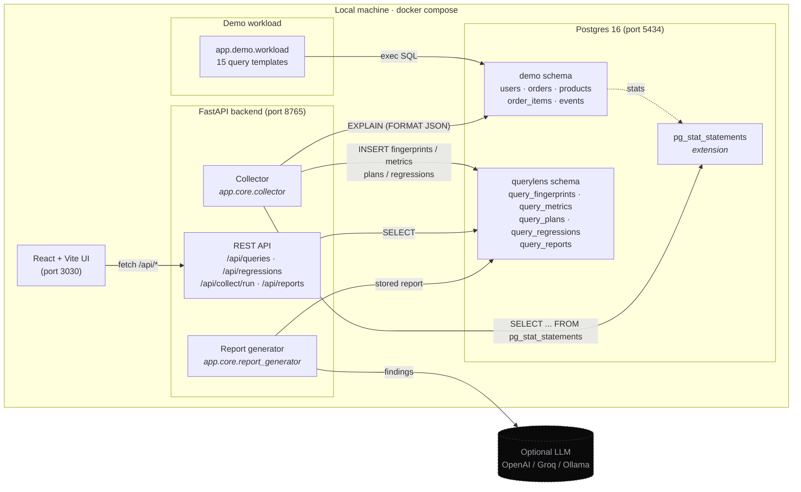
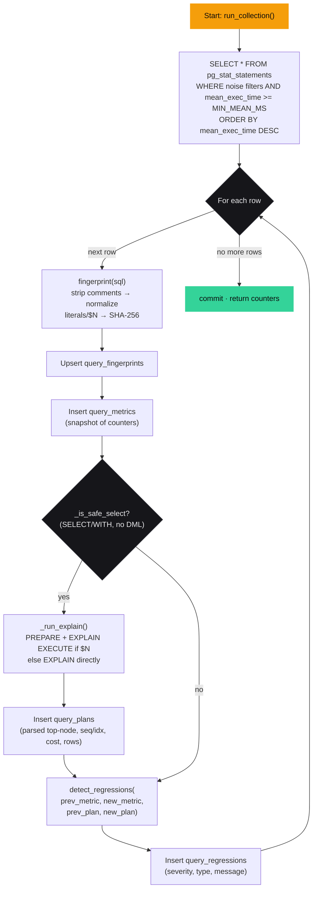
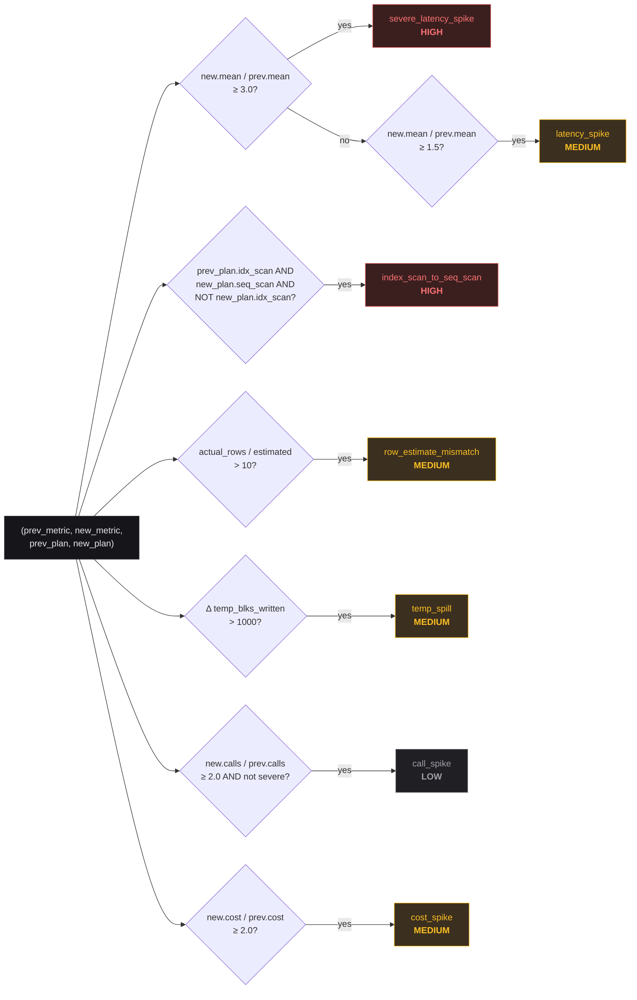
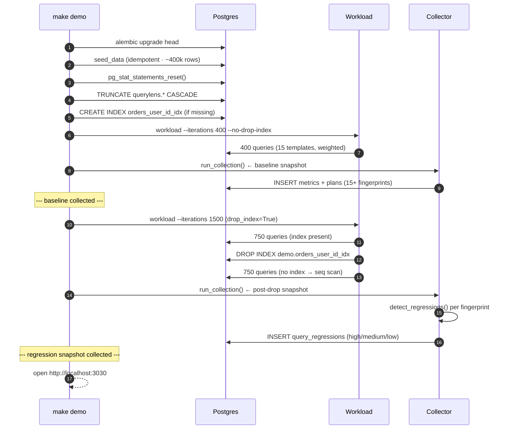
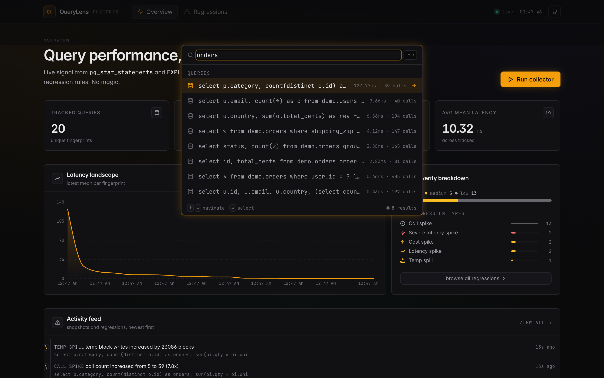

# QueryLens — PostgreSQL Query Performance Monitor

A developer tool that collects PostgreSQL query performance metrics, fingerprints repeated queries, stores execution-plan history, detects query regressions, and surfaces slow queries and plan changes in a React dashboard.

> QueryLens uses deterministic regression rules over `pg_stat_statements` and `EXPLAIN JSON`. The AI layer only turns validated findings into readable reports.


---

## Problem statement

`pg_stat_statements` is Postgres's built-in query profiler. It gives you raw counters but no history, no regression detection, and no plain-English analysis. QueryLens closes that gap by:

- fingerprinting normalized queries so variants collapse to one row
- snapshotting metrics and execution plans on each collection run
- comparing snapshots to detect latency spikes, plan regressions, and row-estimate mismatches using **deterministic rules**
- rendering plain-English reports (template or optional LLM — never the source of truth)

---

## Architecture

One Postgres instance hosts three schemas. The Python backend reads `pg_stat_statements`, fingerprints, snapshots, and runs deterministic rules. The React UI talks to the FastAPI layer over `/api/*`.



**One Postgres instance, three schemas:**
- `public` — `pg_stat_statements` extension
- `demo` — workload tables (`users`, `orders`, `products`, `order_items`, `events`)
- `querylens` — metadata (`query_fingerprints`, `query_metrics`, `query_plans`, `query_regressions`, `query_reports`)

### Collector pipeline

What happens during a single `make collect` (or `POST /api/collect/run`):



### Regression rules

`detect_regressions()` runs every rule against `(prev, new)` snapshots. Latency rules pick the highest matching severity (`severe_latency_spike` suppresses `latency_spike` and `call_spike`).



### Demo lifecycle

`make demo` is reproducible — it always lands the dashboard with the same regressions detected.



---

## Local setup

Requirements: **Docker** and **Docker Compose**.

```bash
git clone https://github.com/sushildalavi/QueryLens-PostgreSQL-Query-Performance-Monitor.git
cd QueryLens-PostgreSQL-Query-Performance-Monitor

# .env is already committed — edit it only if you want to override defaults

docker compose up -d       # starts db + backend + frontend
make demo                  # seeds data, runs workload, runs collector twice
```

Open **http://localhost:3030** — you should see regressions in the dashboard.

To run the collector on-demand:

```bash
make collect
# or
curl -X POST http://localhost:8765/api/collect/run | jq
```

---

## How `pg_stat_statements` works here

`pg_stat_statements` accumulates per-query counters (calls, total/mean execution time, rows, block I/O) across all connections. The collector reads this view on each run, fingerprints each query, stores a metric snapshot, and diffs it against the previous snapshot to detect regressions.

Postgres must be started with:
```
shared_preload_libraries = pg_stat_statements
pg_stat_statements.track = all
```

This is handled automatically by `docker-compose.yml`.

---

## Query fingerprinting

Queries that differ only in literal values are collapsed to the same fingerprint so they share one history.

```
-- two "different" queries:
SELECT * FROM orders WHERE user_id = 123
SELECT * FROM orders WHERE user_id = 456

-- same fingerprint:
select * from orders where user_id = ?
```

Process: strip comments → replace string/numeric literals and `$N` placeholders with `?` → collapse whitespace → lowercase → SHA-256 hash.

`pg_stat_statements` already normalises literals to `$1`, `$2`, ... — the fingerprinter handles both raw literals and placeholders so workload queries and `pg_stat_statements` rows hash identically.

---

## Regression rules

| Type | Trigger | Severity |
|------|---------|----------|
| `severe_latency_spike` | mean exec time ×3+ vs previous | high |
| `latency_spike` | mean exec time ×1.5+ vs previous | medium |
| `index_scan_to_seq_scan` | plan changed from Index Scan → Seq Scan | high |
| `row_estimate_mismatch` | actual / estimated rows > 10 | medium |
| `temp_spill` | temp block writes +1000 vs previous | medium |
| `call_spike` | call count ×2+ vs previous | low |
| `cost_spike` | estimated plan cost ×2+ vs previous | medium |

All rules are implemented in `backend/app/core/regression_detector.py` and are fully unit-tested.

---

## EXPLAIN JSON parsing

For each safe `SELECT` query, the collector runs `EXPLAIN (FORMAT JSON)` (or `EXPLAIN ANALYZE` when `ALLOW_EXPLAIN_ANALYZE=true`) and extracts:

- **Top node type** — root plan node (`Seq Scan`, `Nested Loop`, etc.)
- **`uses_seq_scan`** — any node in the tree is a `Seq Scan`
- **`uses_index_scan`** — any of `Index Scan`, `Index Only Scan`, `Bitmap Index Scan`
- **Estimated/actual rows** — root-level `Plan Rows` and `Actual Rows`
- **Estimated total cost** — root `Total Cost`

For queries from `pg_stat_statements` that use `$N` placeholders, the collector uses `PREPARE` / `EXPLAIN EXECUTE` with `1` as the default parameter so the planner uses real table statistics.

---

## Demo workload

The demo creates ~400k rows across five tables and runs a mix of six named queries:

| Query | What it does |
|-------|-------------|
| `good_user_orders` | Uses `orders.user_id` index — fast |
| `missing_index` | Filters on `shipping_zip` — no index |
| `unindexed_order_by` | `ORDER BY total_cents DESC` — no covering index |
| `like_prefix_wildcard` | `LIKE '%@gmail.com'` — can't use index |
| `sequential_scan` | `count(*) WHERE event_type = ?` — no index |
| `large_join` | users → orders → order_items aggregation |

Halfway through the workload run, the `orders.user_id` index is **dropped**. The next collector run detects an `index_scan_to_seq_scan` regression on `good_user_orders`.

```bash
make demo        # full pipeline: seed → workload → collect × 2
make seed        # just seed data
make workload    # just workload (N=500 default)
make collect     # just run the collector
```

---

## API reference

Full Swagger UI at **http://localhost:8765/docs**

```bash
# health
curl localhost:8765/health

# list slow queries
curl "localhost:8765/api/queries?sort=mean_latency_desc&limit=10" | jq

# list regressions
curl "localhost:8765/api/regressions?severity=high" | jq

# trigger collection
curl -X POST localhost:8765/api/collect/run | jq

# generate report for a query
curl -X POST "localhost:8765/api/reports/<fingerprint_id>/generate" | jq
```

---

## AI report layer

The report generator (`backend/app/core/report_generator.py`) builds a deterministic **findings dict** from ORM objects, then renders it as plain English.

- **Default (no key required):** A deterministic template constructs a 2–4 sentence summary from the findings.
- **Optional LLM:** Set `LLM_ENABLED=true` and provide `OPENAI_API_KEY`. Works with OpenAI, Groq free tier, or a local Ollama instance via `OPENAI_BASE_URL`.

The LLM prompt instructs:
- use only provided facts, never invent numbers or table names
- phrase suggestions as "Candidate optimization: review whether …"
- never claim a fix is guaranteed

---

## Tests

```bash
make test            # all 40 tests (requires Docker for integration)
make test-unit       # 30 pure unit tests (no Docker)
```

Tests cover:
- `test_fingerprint.py` — 11 cases: literals, placeholders, whitespace, stability
- `test_explain_parser.py` — 6 cases: seq scan, index scan, nested loop, no-ANALYZE
- `test_regression_detector.py` — 13 cases: every regression type + edge cases
- `test_collector.py` — 3 integration cases: metrics stored, upsert, index drop → regression
- `test_api_smoke.py` — 7 smoke tests: all routes return correct shape

---

## Screenshots

> **Dashboard** — bento layout with KPI cards, latency landscape, severity breakdown with top regression types, activity feed timeline, and a sortable & filterable slowest-query table.


> **Command palette** — `⌘K` (or `/`) opens a fuzzy search across queries, regressions, and actions. Arrow keys to navigate, Enter to drill in.


> **Query detail** — SQL with syntax highlighting and line numbers, mean-exec & call-count time series with an animated peak marker, parsed execution plan tree, and full regression history for the fingerprint.


> **Regressions feed** — every detection by severity and type, with one click to drill into the offending fingerprint.


Screenshots are captured headlessly with Playwright (`docs/screenshots/capture.mjs`) against a running stack — they reflect real demo data, not mocks. Run `make screenshots` to regenerate.

---

## Limitations

- Single-tenant, no authentication
- Collector is on-demand (`POST /api/collect/run`). For production, trigger via Cloud Scheduler or a cron job
- `EXPLAIN ANALYZE` is disabled by default (`ALLOW_EXPLAIN_ANALYZE=false`) — enable only against the demo DB
- `pg_stat_statements` parameterized queries use `PREPARE`/`EXPLAIN EXECUTE(1)` — plan may not reflect all query shapes
- Only the latest plan is shown in the UI; plan-diff is roadmap

## Roadmap

- Continuous collector daemon with scheduling UI
- Side-by-side plan diff
- Per-database / multi-DSN support
- Query tagging and ignore-list
- Slack/webhook alerts on high-severity regressions
